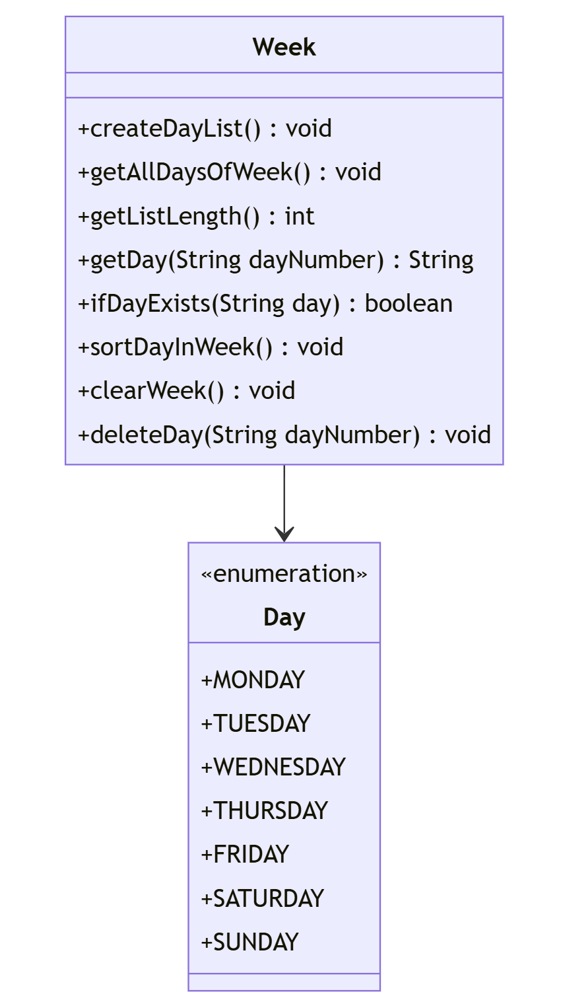
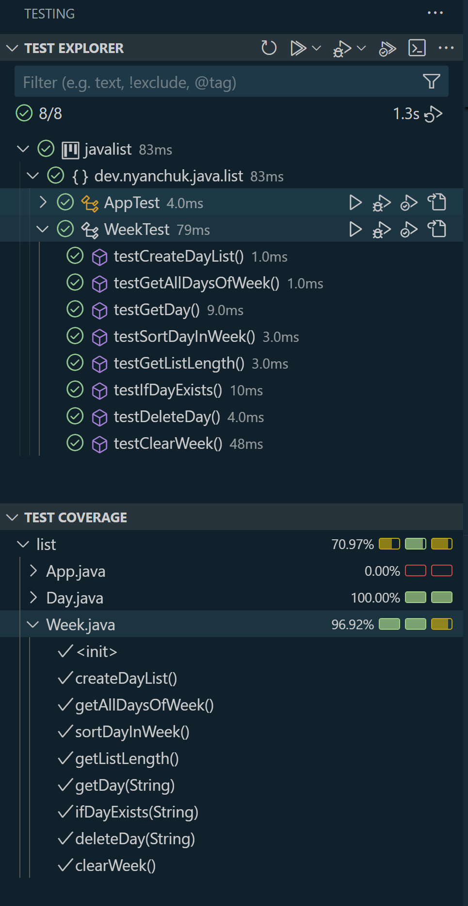

# JavaList: Week Manager

This Java project defines a `Week` class responsible for managing the days of the week. The class offers a set of methods for managing a list of days, including adding, removing, sorting, and clearing days. The project includes unit tests for each method, ensuring a minimum test coverage of 70%.

## Features

The `Week` class provides the following methods:

1. **Create the List of Days**: Initializes the list with all days of the week.
2. **Get All Days**: Returns the list of all days in the week.
3. **Get List Length**: Returns the number of days in the list.
4. **Delete a Day**: Removes a specified day from the list by index.
5. **Get a Specific Day**: Retrieves a specified day from the list by index.
6. **Check if Day Exists**: Returns whether a specified day exists in the list.
7. **Sort Days Alphabetically**: Sorts the list of days in alphabetical order.
8. **Clear the List**: Empties the list of days.

## Requirements

- **Unit Testing**: Each method has an accompanying unit test, achieving a minimum of 70% code coverage.
- **Java Collections**: Utilizes the `List` collection from `java.util`.

## Dependencies

Ensure you have Java 8 or higher installed, along with a JUnit testing framework.

## Project Setup

1. **Clone the repository**:
    ```bash
    git clone https://github.com/NelliYanchuk/javalist.git
    cd javalist
    ```

2. **Running Tests**:
    - Execute the tests to verify functionality and code coverage.
    - In Visual Studio Code, use the Testing tab to run tests and view code coverage results.

## Class Diagram



Also you can find diagram here `screenshot/project-diagram.png`

## Testing and Code Coverage

In Visual Studio Code, navigate to the **Testing** section to run tests and observe code coverage. The project ensures a minimum of 70% coverage across all methods.



Also you can find test covering here `screenshot/test-cover-list.png`

## Connect with me:

- [GitHub](https://github.com/NelliYanchuk)
- [LinkedIn](https://www.linkedin.com/in/nelli-yanchuk-a24b81138/)
